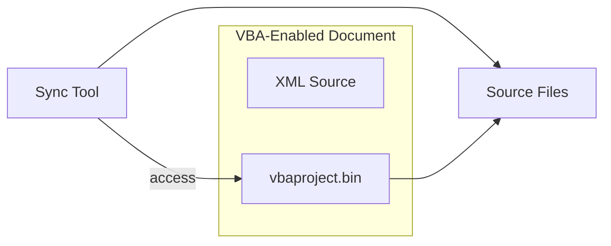
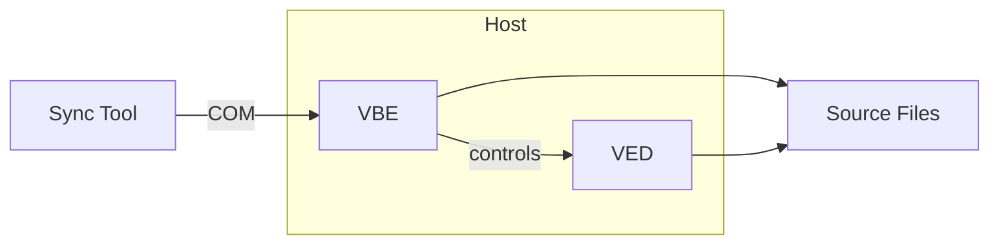

This document offers a listing of existing tools that enable VBA code syncing between the VBA-Enabled Document (VED) and the file system (source files).

//WIP

In order to sync the two, we need to be able to perform 2 operations:
- Extract the source code from a VED
- Build the VED from the source file

## Terminology

VBA-Enabled Document (VED).


## Extract the source code from a VED

### Extract the code from the vbaProject.bin file

It is well known that most VED are simply zip files in disguise. It's then possible to use a tool to decompress the content of the VED and access directly the vbaProject.bin file.

However, the process of parsing the binary file is non-trivial and requires knowledge of OLE objects.

#### Readings

See also [Related StackOverflow Question](https://stackoverflow.com/questions/17536607/read-vba-macros-or-vbaproject-bin-of-an-excel-file-without-opening-it-in-ms-ex)

See also [Why are the Microsoft Office file formats so complicated? (And some workarounds) – Joel on Software](https://www.joelonsoftware.com/2008/02/19/why-are-the-microsoft-office-file-formats-so-complicated-and-some-workarounds/ "https://www.joelonsoftware.com/2008/02/19/why-are-the-microsoft-office-file-formats-so-complicated-and-some-workarounds/"). Note however that the [document](https://web.archive.org/web/20081203235018/http://download.microsoft.com/download/0/B/E/0BE8BDD7-E5E8-422A-ABFD-4342ED7AD886/Excel97-2007BinaryFileFormat(xls)Specification.pdf) Joel talks about the VBA Project doesn't cover the VBA Project.

#### Diagram 1:



#### List of tools using this approach:
- [olevba](https://github.com/decalage2/oletools)
- [ms_ovba](https://github.com/Beakerboy/MS-OVBA)
- [olefield](https://github.com/shamrin/olefield)?


### Using the VBE to extract the code


#### List of tools using this approach:

- XVBA
- My VBA-Sync Demo

## Summary

### Static operations

| Tools name | Extract | Build |
|------------|---------|-------|
| vbapm     |    ✅[^2]    |   ✅[^2]  |
| olevba     |   ✅    |   ❌[^1]  |
| ms_ovba     |   ❔    |   ❔[^3]  |

### Live (syncing with live document)

| Tools name | Extract | Build |
|------------|---------|-------|
| vbapm     |   ❔    |   ❔  |
| olevba     |   ❌   |   ❌  |


// TODO: Create seperate table for Mac

// TODO: Create section about the python ms_ovba tooling:
```bash
python -m pip install --upgrade pip setuptools
python -m pip install git+https://github.com/Beakerboy/MS-CFB@dev
python -m pip install git+https://github.com/Beakerboy/MS-OVBA@dev
python -m pip install git+https://github.com/Beakerboy/Excel-Addin-Generator@File-hash
python -m ms_ovba ${{ github.workspace }}/${{ inputs.path }}
python -m excel_addin_generator ./vbaProject.bin ${{ github.workspace }}/${{ inputs.file_name }}
```

## Footnotes
[^1] olevba does not support Build. See [oletools issue #555](https://github.com/decalage2/oletools/issues/555).

[^2] vbapm will just launch the host application if closed.

[^3] Not fully working per [issue 116](https://github.com/Beakerboy/MS-OVBA/issues/116)
