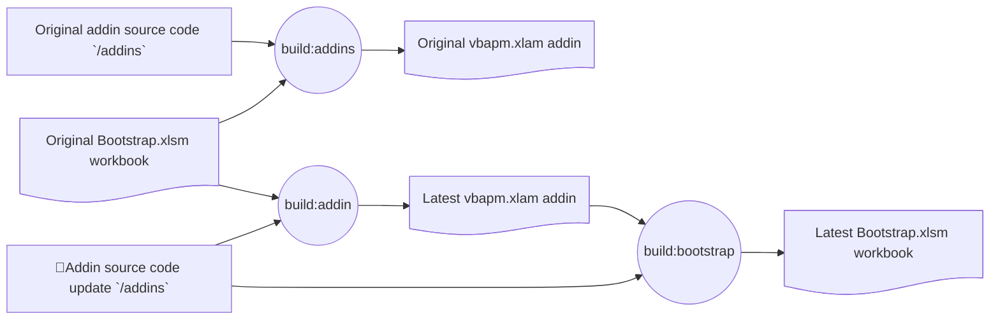

# Development Build Process

This document explains how the build pipeline works in this repository, from TypeScript compilation to VBA add-in artifacts.

## Build Commands at a Glance

- `npm run build` compiles the CLI/library into `lib/` and ensures vendor runtime assets.
- `npm run build:bootstrap` builds the bootstrap workbook (`scripts/bootstrap/build/bootstrap.xlsm`).
- `npm run build:addins` builds the production add-ins in `addins/build/` using the bootstrap workbook as the automation host.
- `npm version` chains `build` + `build:addins` + package creation.

## Bootstraping

The approach used in this project to build VBA documents is to have a VBA addin that lives within the VBA environment and acts as the relay between the package manager CLI and the VBA host.

However, in order to build that VBA addin in our build pipeline, we need a way to build a VBA document! This is the classic chicken-and-egg problem. We solve it by including the latest version of Bootstrap.xlsm (`scripts/bootstrap/build/bootstrap.xlsm`) inside the repo such that this file can be used to build the VBA addin with the latest source code.

Update flow for vbapm.xlam and bootstrap.xlsm

## Windows Integration CI Workflow

In the Windows integration workflow, CI currently runs:

- `npm install`
- `npm run build`
- `npm run build:addins`

Because `scripts/bootstrap/build/bootstrap.xlsm` is already present in the repo, CI can build add-ins without first running `build:bootstrap`.

## Development Build Process (Practical Flow)

For day-to-day development, the expected flow is:

1. Build the JS/TS library (`npm run build`).
2. Use the committed bootstrap file to build the current add-in (`npm run build:addins`).
3. Optionally regenerate bootstrap (`npm run build:bootstrap`) when intentionally refreshing the seed host.

This gives both:

- Self-hosting evolution of the compiler/add-in code.
- A stable, committed starting point so new machines and CI are not blocked.
